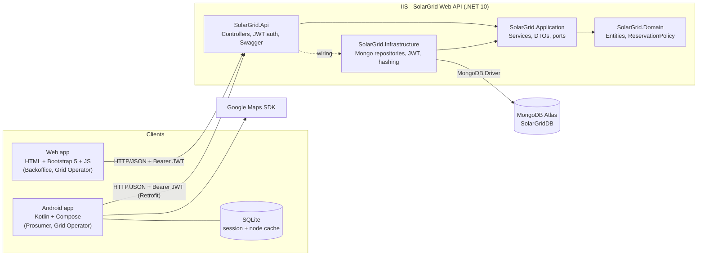
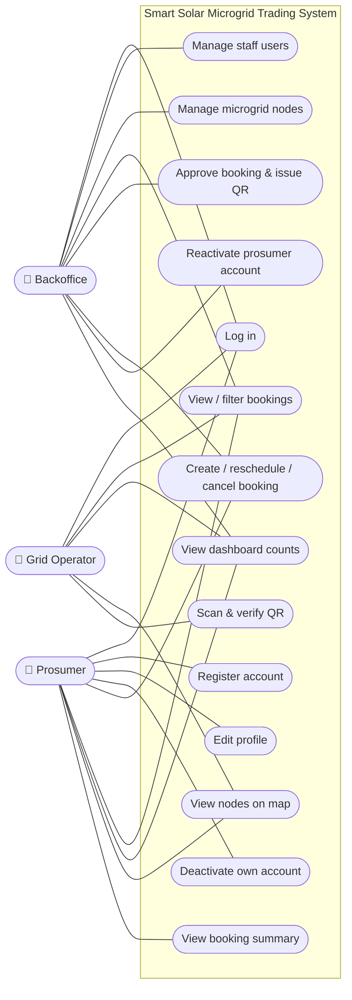
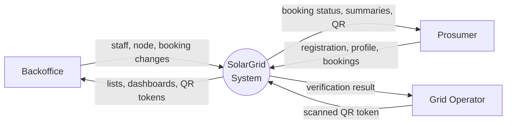
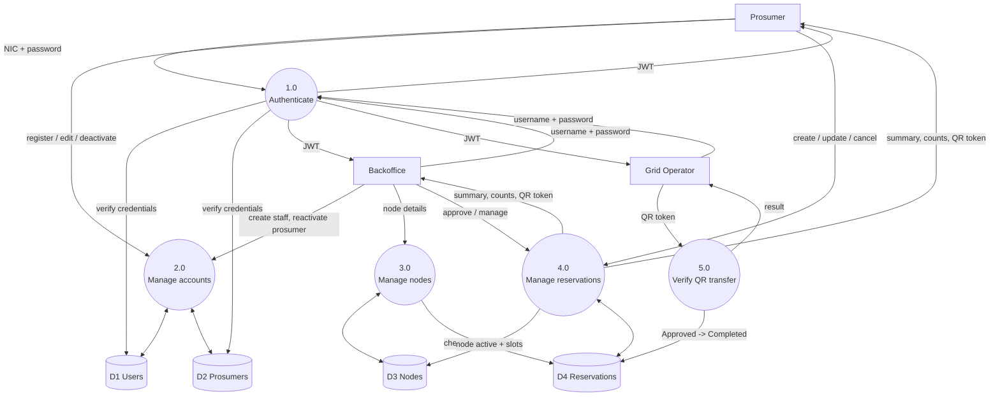
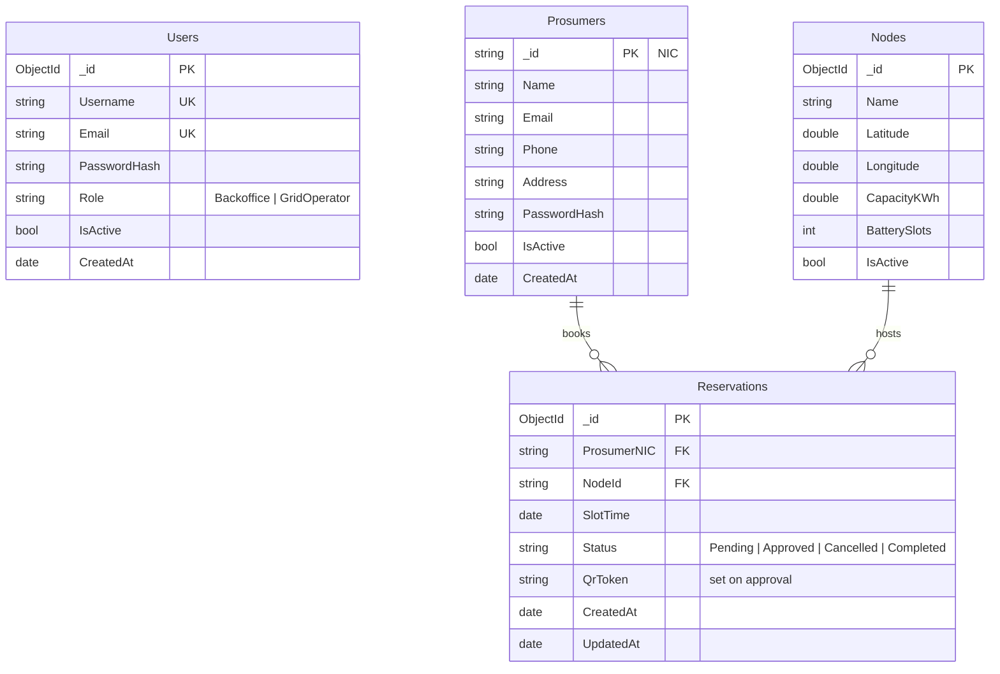

# SolarGrid Diagrams

These are Mermaid diagrams. GitHub renders them inline. To put them in the report, paste each block
into https://mermaid.live and export it as PNG/SVG.

## 1. High-level architecture

## 2. Use case diagram

## 3. Data flow diagram

### Level 0 (context)

### Level 1

## 4. Database design (MongoDB collections)

Indexes: `Users.Username` and `Users.Email` (unique), `Reservations (ProsumerNIC, SlotTime)`,
`Reservations (NodeId, SlotTime)`, `Reservations.QrToken`.
